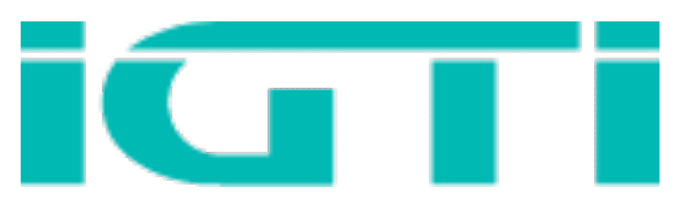

<h5 align="center"></h5>

<h2 align="center">API de Pesquisa NPS</h2>

#### :pencil: Implementação:
API construida em `Typescript` com conexão ao Banco `Postgres` e dockeirizada em uma imagem totalmente efêmera, criada para receber os dados sensiveis em sua instância.
API foi para produção, executando em um servidor apache com certificado SSL que faz o proxy para a porta do `Docker`.
 

#### Front-end:

Implementei uma estratégia de cacheamento de dados para controlar a quantidade de requisições feitas ao banco, o script inserido no [Canvas Instructure](https://igti.instructure.com/login/canvas) (AVA Acadêmico) da instituição, é responsável por coletar a identificação e a nota fornecida para pesquisa.

 

  Built with ❤︎ by <a href="https://github.com/igorryan">Igor Ryan</a>

[typescript-image]: https://img.shields.io/badge/Typescript-294E80.svg?style=for-the-badge&logo=typescript

[license-url]: LICENSE.md
[license-image]: https://img.shields.io/github/license/adonisjs/adonis-framework?style=for-the-badge
